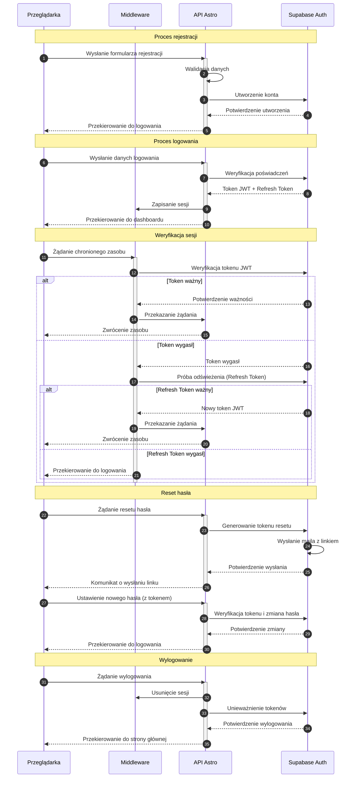

# Diagram architektury autentykacji

<authentication_analysis>
1. Przepływy autentykacji:
   - Rejestracja nowego użytkownika (email + hasło)
   - Logowanie użytkownika
   - Resetowanie hasła
   - Odświeżanie tokenu sesji
   - Wylogowanie

2. Główni aktorzy:
   - Przeglądarka (interfejs użytkownika)
   - Middleware Astro (warstwa pośrednia)
   - API Astro (endpointy aplikacji)
   - Supabase Auth (usługa autentykacji)

3. Procesy weryfikacji i odświeżania tokenów:
   - Weryfikacja tokenu JWT przy każdym żądaniu
   - Automatyczne odświeżanie tokenu przed wygaśnięciem
   - Obsługa wygasłych tokenów i przekierowanie do logowania

4. Kroki autentykacji:
   - Walidacja danych wejściowych
   - Weryfikacja poświadczeń
   - Generowanie tokenów
   - Zarządzanie sesją
   - Obsługa błędów i przekierowania
</authentication_analysis>

<mermaid_diagram>

</mermaid_diagram> 