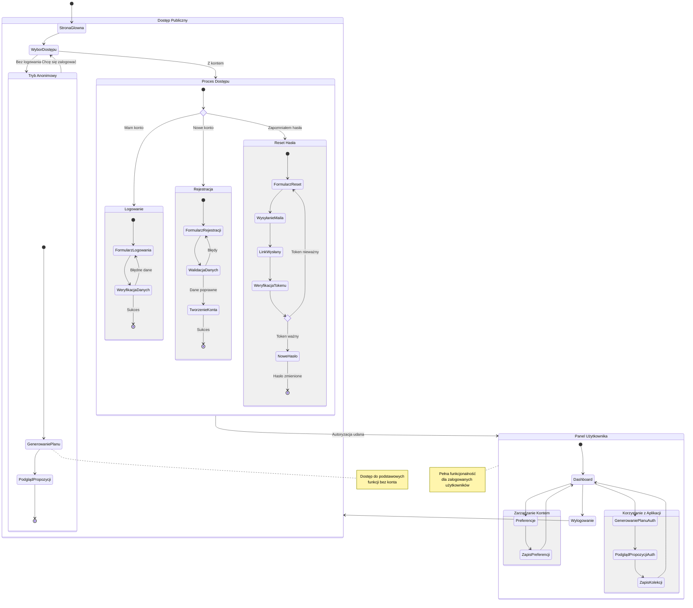

# Diagram podróży użytkownika dla modułu autentykacji

<user_journey_analysis>
1. Ścieżki użytkownika:
   - Rejestracja nowego użytkownika
   - Logowanie do systemu
   - Reset hasła
   - Zarządzanie preferencjami
   - Wylogowanie

2. Główne podróże i stany:
   - Niezalogowany użytkownik (dostęp do podstawowych funkcji)
   - Proces rejestracji i logowania
   - Zarządzanie kontem
   - Odzyskiwanie dostępu
   - Sesja zalogowanego użytkownika

3. Punkty decyzyjne:
   - Wybór między rejestracją a logowaniem
   - Weryfikacja danych logowania
   - Weryfikacja tokenu resetu hasła
   - Dostęp do chronionych zasobów

4. Cel każdego stanu:
   - Strona główna: Wprowadzenie do aplikacji
   - Rejestracja: Utworzenie nowego konta
   - Logowanie: Dostęp do pełnej funkcjonalności
   - Reset hasła: Odzyskanie dostępu
   - Preferencje: Personalizacja ustawień
</user_journey_analysis>

<mermaid_diagram>

</mermaid_diagram>

Diagram przedstawia:
1. Kompletną ścieżkę użytkownika od wejścia na stronę do pełnego korzystania z aplikacji
2. Wszystkie możliwe stany i przejścia między nimi
3. Punkty decyzyjne i alternatywne ścieżki
4. Różnice między dostępem anonimowym a zalogowanym
5. Procesy autentykacji i zarządzania kontem 