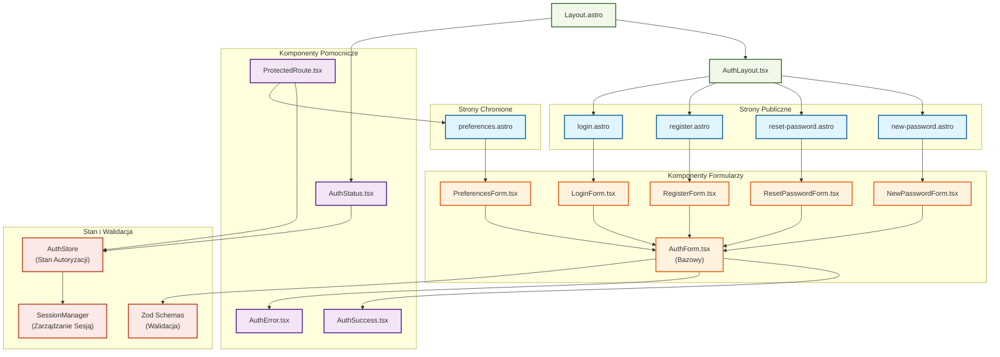

# Diagram architektury UI dla modułu autentykacji

<architecture_analysis>
1. Komponenty wymienione w specyfikacji:
   - Strony Astro (server-side)
   - Komponenty React (client-side)
   - Formularze autentykacji
   - Komponenty pomocnicze
   - Komponenty stanu i walidacji

2. Główne strony i komponenty:
   - Strony publiczne: login, register, reset-password, new-password
   - Strony chronione: preferences
   - Formularze: AuthForm, LoginForm, RegisterForm, ResetPasswordForm, NewPasswordForm, PreferencesForm
   - Komponenty UI: AuthLayout, ProtectedRoute, AuthStatus, AuthError, AuthSuccess

3. Przepływ danych:
   - Walidacja formularzy (Zod)
   - Zarządzanie stanem autoryzacji
   - Obsługa sesji i tokenów
   - Komunikacja z Supabase Auth

4. Funkcjonalność komponentów:
   - Formularze: wprowadzanie i walidacja danych
   - Layout: struktura i nawigacja
   - Status: informacje o stanie autoryzacji
   - Komunikaty: obsługa błędów i sukcesu
</architecture_analysis>

<mermaid_diagram>

</mermaid_diagram>

Diagram przedstawia kompletną architekturę UI modułu autentykacji, uwzględniając:
1. Hierarchię komponentów i ich zależności
2. Podział na strony server-side (Astro) i komponenty client-side (React)
3. Przepływ danych między komponentami
4. Integrację z systemem zarządzania stanem i walidacją
5. Wyraźne rozróżnienie między komponentami publicznymi i chronionymi 